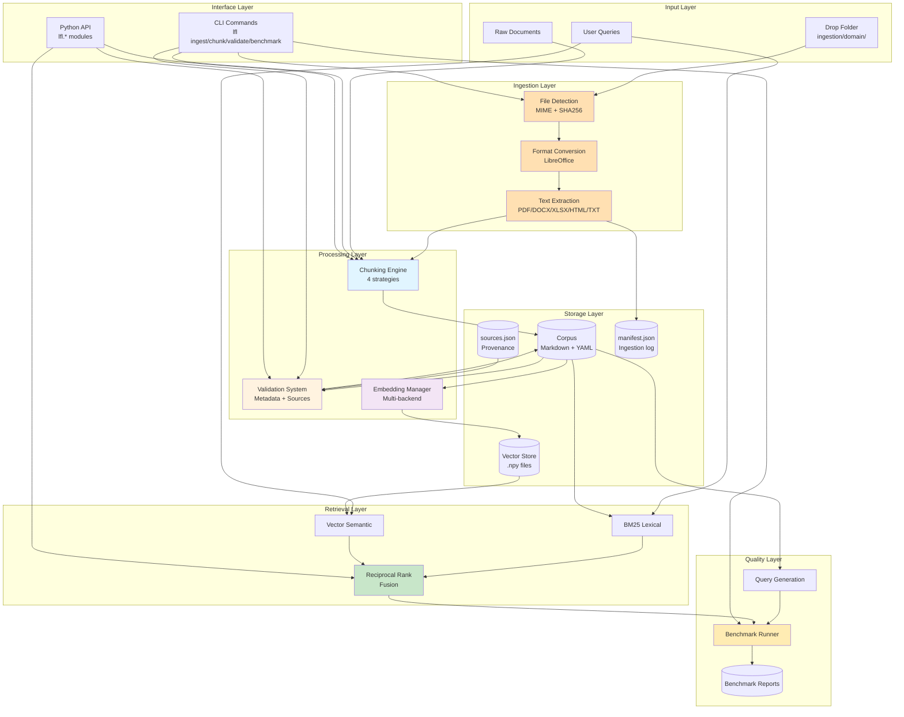
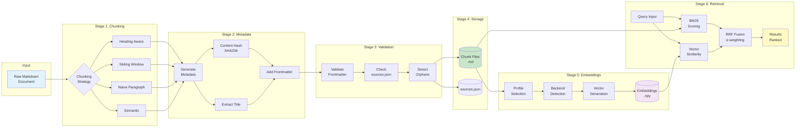
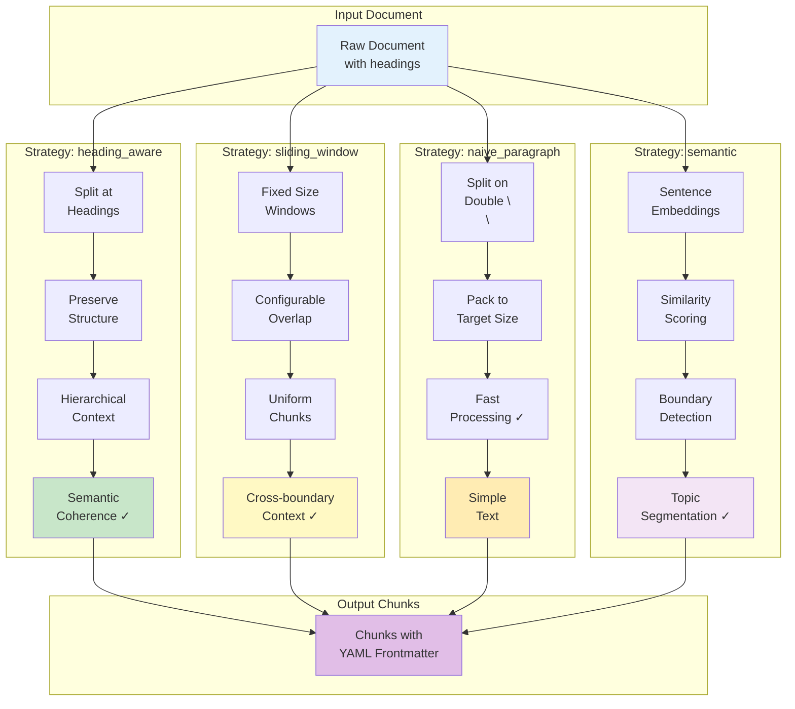
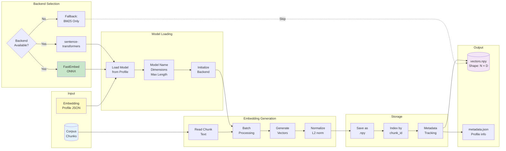
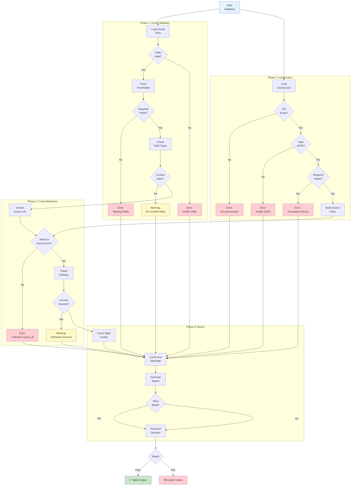

# Little Free Library Toolkit — Architecture Diagrams

This document provides visual representations of the toolkit's architecture, data flows, and major components.

## Table of Contents

1. [System Overview](#system-overview)
2. [Data Pipeline](#data-pipeline)
3. [Chunking Strategies](#chunking-strategies)
4. [Hybrid Retrieval Architecture](#hybrid-retrieval-architecture)
5. [CLI Command Structure](#cli-command-structure)
6. [Embedding Pipeline](#embedding-pipeline)
7. [Validation Flow](#validation-flow)
8. [Benchmarking System](#benchmarking-system)

---

## System Overview

High-level architecture showing all major components:



**Key Components:**
- **Ingestion Layer**: Detect, convert, and extract text from arbitrary document formats
- **Chunking Engine**: Transforms raw/extracted text into structured chunks
- **Validation System**: Ensures corpus quality and metadata completeness
- **Embedding Manager**: Generates and manages vector representations
- **Retrieval Layer**: Hybrid search combining BM25 and vector search
- **Quality Layer**: Automated benchmarking and quality assessment
- **Interface Layer**: CLI and Python API for all functionality

---

## Data Pipeline

End-to-end data flow from raw documents to retrieval:



**Pipeline Stages:**
1. **Chunking**: Split documents using selected strategy
2. **Metadata**: Add complete metadata and content hashing
3. **Validation**: Verify structure and provenance
4. **Storage**: Save validated chunks to disk
5. **Embeddings**: Generate vector representations (optional)
6. **Retrieval**: Search using BM25, vector, or hybrid mode

---

## Chunking Strategies

Different approaches to splitting documents:



**Strategy Comparison:**

| Strategy | Best For | Speed | Quality | Complexity |
|----------|----------|-------|---------|------------|
| **heading_aware** | Technical docs with structure | ⚡⚡⚡ | ⭐⭐⭐⭐ | Low |
| **sliding_window** | Dense content, uniform chunks | ⚡⚡ | ⭐⭐⭐ | Low |
| **naive_paragraph** | Simple text, quick processing | ⚡⚡⚡⚡ | ⭐⭐ | Very Low |
| **semantic** | Topic-based segmentation | ⚡ | ⭐⭐⭐⭐⭐ | High |

---

## Hybrid Retrieval Architecture

How BM25 and vector search combine:

```mermaid
flowchart TB
    subgraph "Query Input"
        Q[User Query:<br/>"python list comprehension"]
    end
    
    subgraph "Parallel Retrieval"
        direction TB
        
        subgraph "BM25 Path"
            B1[Tokenize<br/>Query]
            B2[Compute<br/>BM25 Scores]
            B3[Rank by<br/>Score]
            B4[Top-K<br/>Results]
            
            B1 --> B2 --> B3 --> B4
        end
        
        subgraph "Vector Path"
            V1[Embed<br/>Query]
            V2[Cosine<br/>Similarity]
            V3[Rank by<br/>Similarity]
            V4[Top-K<br/>Results]
            
            V1 --> V2 --> V3 --> V4
        end
    end
    
    subgraph "Fusion Layer"
        direction TB
        RRF1[Reciprocal<br/>Rank Fusion]
        RRF2[Score = 1/(k+rank)]
        RRF3[α * BM25 +<br/>1-α * Vector]
        RRF4[Merge &<br/>Dedupe]
        
        RRF1 --> RRF2 --> RRF3 --> RRF4
    end
    
    subgraph "Final Results"
        R1[1. Chunk A: 0.95]
        R2[2. Chunk C: 0.87]
        R3[3. Chunk B: 0.82]
        R4[...]
    end
    
    subgraph "Corpus Data"
        C[(Markdown<br/>Chunks)]
        E[(Vector<br/>Embeddings)]
    end
    
    Q --> B1
    Q --> V1
    
    C --> B2
    E --> V2
    
    B4 --> RRF1
    V4 --> RRF1
    
    RRF4 --> R1 & R2 & R3 & R4
    
    style Q fill:#e3f2fd
    style B4 fill:#fff9c4
    style V4 fill:#f3e5f5
    style RRF4 fill:#c8e6c9
    style R1 fill:#a5d6a7
```

**RRF Formula:**

```
score_rrf(doc) = α * score_bm25(doc) + (1-α) * score_vector(doc)

where:
  score_bm25  = 1 / (k + rank_bm25)
  score_vector = 1 / (k + rank_vector)
  k = 60 (standard RRF constant)
  α = BM25 weight (0.0 to 1.0, default: 0.5)
```

**Alpha Parameter Guide:**
- `α = 0.0`: Vector only (semantic search)
- `α = 0.3`: Favor vector (70% semantic, 30% lexical)
- `α = 0.5`: Balanced hybrid (50/50)
- `α = 0.7`: Favor BM25 (70% lexical, 30% semantic)
- `α = 1.0`: BM25 only (keyword search)

---

## CLI Command Structure

Command hierarchy and data flow:

```mermaid
graph TB
    subgraph "CLI Entry Point"
        Main[lfl<br/>Main CLI]
    end
    
    subgraph "Commands"
        Ingest[lfl ingest<br/>Drop-Folder → Corpus]
        Chunk[lfl chunk<br/>Document → Chunks]
        Validate[lfl validate<br/>Check Metadata]
        Benchmark[lfl benchmark<br/>Quality Testing]
        Version[lfl version<br/>Show Version]
    end
    
    subgraph "ingest Options"
        I1[--input<br/>input directory]
        I2[--inventory<br/>dry-run]
        I3[--embed<br/>generate vectors]
        I4[--on-duplicate<br/>skip/overwrite/error]
        I5[--strategy<br/>heading_aware]
        I6[--chunk-size<br/>512]
    end
    
    subgraph "chunk Options"
        C1[--strategy<br/>heading_aware]
        C2[--chunk-size<br/>500]
        C3[--overlap<br/>0]
        C4[--domain<br/>programming]
    end
    
    subgraph "validate Options"
        V1[--strict<br/>Fail on warnings]
    end
    
    subgraph "benchmark Subcommands"
        BR[run<br/>Single test]
        BS[sweep<br/>Parameter sweep]
        BC[compare<br/>Compare reports]
    end
    
    subgraph "Outputs"
        Out0[(Ingested<br/>Corpus + Manifest)]
        Out1[(Corpus<br/>Chunks)]
        Out2[Validation<br/>Report]
        Out3[Benchmark<br/>Report JSON]
    end
    
    Main --> Ingest
    Main --> Chunk
    Main --> Validate
    Main --> Benchmark
    Main --> Version
    
    Ingest --> I1 & I2 & I3 & I4 & I5 & I6
    Chunk --> C1 & C2 & C3 & C4
    Validate --> V1
    Benchmark --> BR & BS & BC
    
    Ingest --> Out0
    Chunk --> Out1
    Validate --> Out2
    Benchmark --> Out3
    
    style Main fill:#e1f5ff
    style Ingest fill:#ffe0b2
    style Chunk fill:#c8e6c9
    style Validate fill:#fff9c4
    style Benchmark fill:#ffecb3
    style Version fill:#f3e5f5
```



**Command Quick Reference:**

```bash
# Ingest documents from drop folder
lfl ingest programming
lfl ingest programming --inventory           # dry-run
lfl ingest programming --embed --profile baseline_cpu_onnx_small
lfl ingest programming --on-duplicate skip   # idempotent re-run

# Chunk documents
lfl chunk input.md output/ --strategy heading_aware --chunk-size 500

# Validate corpus
lfl validate corpora/programming --strict

# Benchmark quality
lfl benchmark run corpora/programming
lfl benchmark sweep corpora/programming
lfl benchmark compare corpora/programming

# Show version
lfl version
```

---

## Embedding Pipeline

Vector embedding generation workflow:



**Supported Backends:**
- **FastEmbed** (ONNX): Fast, CPU-optimized, cross-platform
- **sentence-transformers** (PyTorch): More model choices, GPU support
- **Fallback**: BM25-only mode if no backend available

**Official Profiles:**
- `baseline_cpu_onnx_small` — 384D, nomic-embed-text-v1.5
- `quality_cpu_onnx_base` — 768D, BAAI/bge-base-en-v1.5
- `power_user_cuda` — 1024D, BAAI/bge-large-en-v1.5 (GPU)
- `power_user_rocm` — 1024D, BAAI/bge-large-en-v1.5 (AMD)
- `windows_gpu_directml` — 768D, BAAI/bge-base-en-v1.5 (Windows)

---

## Validation Flow

Comprehensive corpus validation process:



**Required Metadata Fields:**
- title, domain, subdomain
- source, source_license, source_id
- retrieved_at, verified
- chunk_tokens (recommended)
- content_hash (recommended)

**sources.json Required Fields:**
- source_id, title, url
- license, license_url
- tier, retrieved_at, verified

---

## Benchmarking System

Automated quality assessment workflow:

```mermaid
flowchart TB
    subgraph "Input"
        Corpus[(Corpus<br/>Chunks)]
        Config[Benchmark<br/>Config]
    end
    
    subgraph "Query Generation"
        Q1[Load Chunk<br/>Content]
        Q2{Strategy?}
        Q3a[Heuristic:<br/>Keyword Extract]
        Q3b[Extractive:<br/>Sentence Select]
        Q3c[LLM:<br/>Generate Queries]
        Q4[Synthetic<br/>Queries]
        
        Q1 --> Q2
        Q2 -->|heuristic| Q3a
        Q2 -->|extractive| Q3b
        Q2 -->|llm| Q3c
        Q3a & Q3b & Q3c --> Q4
    end
    
    subgraph "Retrieval Testing"
        R1[For Each<br/>Query]
        R2[Run<br/>Retrieval]
        R3[Check if<br/>Source Chunk<br/>in Results]
        R4[Record Rank<br/>Position]
        
        R1 --> R2 --> R3 --> R4
    end
    
    subgraph "Metrics Calculation"
        M1[Recall@k:<br/>% Found]
        M2[MRR:<br/>Mean Recip Rank]
        M3[Token<br/>Efficiency]
        M4[Final Score:<br/>Weighted Avg]
        
        M1 & M2 & M3 --> M4
    end
    
    subgraph "Reporting"
        Rep1[Generate<br/>Report JSON]
        Rep2[Timestamp<br/>& Version]
        Rep3[Save to<br/>reports/]
        Rep4[Summary<br/>Output]
        
        Rep1 --> Rep2 --> Rep3 --> Rep4
    end
    
    subgraph "Sweep Mode"
        Sw1[Multiple<br/>Configs]
        Sw2[Chunk sizes:<br/>300, 500, 800]
        Sw3[Query counts:<br/>10, 20, 50]
        Sw4[Find Best<br/>Config]
        
        Sw1 --> Sw2 & Sw3 --> Sw4
    end
    
    Corpus --> Q1
    Config --> Q2
    
    Q4 --> R1
    Corpus --> R2
    
    R4 --> M1
    M4 --> Rep1
    
    Config -.->|sweep| Sw1
    Sw4 --> Rep1
    
    Rep4 --> Output[📊 Benchmark<br/>Results]
    
    style Corpus fill:#e3f2fd
    style Q4 fill:#fff9c4
    style M4 fill:#c8e6c9
    style Output fill:#a5d6a7
```

**Benchmark Metrics:**

1. **Recall@k**: Percentage of queries where the source chunk appears in top-k results
2. **MRR**: Mean Reciprocal Rank — average of 1/rank for all queries
3. **Token Efficiency**: Quality score adjusted for chunk size overhead
4. **Final Score**: Weighted combination of all metrics

**Formula:**
```
final_score = (recall@k * 2 + MRR + token_efficiency) / 4

where:
  recall@k = chunks_found / total_queries
  MRR = mean(1 / rank_position)
  token_efficiency = (recall@k * ideal_tokens) / actual_tokens
```

---

## Usage Examples

### Complete Pipeline Workflow

```bash
# 1. Chunk documents
lfl chunk input.md corpora/domain/chunks/ \\
  --strategy heading_aware \\
  --chunk-size 500

# 2. Validate corpus
lfl validate corpora/domain --strict

# 3. Test retrieval
python -c "
from lfl.retrieval import HybridRetriever
r = HybridRetriever('corpora/domain', mode='bm25')
results = r.retrieve('test query', top_k=5)
for res in results: print(res.title, res.score)
"

# 4. Run benchmarks
lfl benchmark run corpora/domain
lfl benchmark sweep corpora/domain
lfl benchmark compare corpora/domain
```

### Python API Workflow

```python
from lfl.chunking import chunk_document
from lfl.corpus_validation import validate_corpus
from lfl.retrieval import HybridRetriever

# Chunk
chunks = chunk_document(content, strategy="heading_aware", metadata={...})

# Validate
is_valid, *stats = validate_corpus("corpora/domain")

# Retrieve
retriever = HybridRetriever("corpora/domain", mode="hybrid", alpha=0.5)
results = retriever.retrieve("query", top_k=10)
```

---

## Architecture Principles

1. **Modularity**: Each component works independently
2. **Reproducibility**: Same inputs → same outputs
3. **Graceful Degradation**: Optional features fail safely
4. **Format Agnostic**: Works with any RAG framework
5. **Quality First**: Comprehensive validation and benchmarking
6. **Developer Friendly**: Clear APIs, helpful errors
7. **Community Driven**: Open source, transparent design

---

## References

- [System Architecture Overview](overview.rst)
- [API Reference](modules/index.rst)
- [CLI Documentation](cli.rst)
- [CHANGELOG.md](../../CHANGELOG.md)
- [IMPLEMENTATION_REPORT_2026-02-26.md](../IMPLEMENTATION_REPORT_2026-02-26.md)

---

*Architecture documentation for Little Free Library Toolkit v1.0.0*
